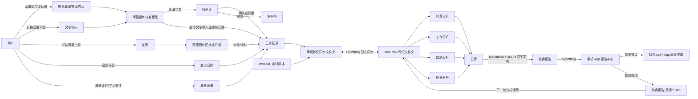

# 秒记系统全景说明（Mac mini AI 必读）

> 版本日期：2026-09-18\
> 本文件用于让 Mac mini 上的 Codex、Claude Cowork 或其他 AI 在开始部署、分析或修改任务前，快速理解整套系统。\
> 原则：**同步目录中的原始文件是事实来源；手机 App 是采集、确认、展示和提醒端；Mini 是同步、分析和报告生成端。**

## 1. 系统目标

“秒记”不是单纯记账 App，而是一套个人数据闭环：

1. 手机用低摩擦方式采集财务、工作、健康、成长数据。
2. 重要的 AI 识别结果先由用户确认，避免模型误写正式数据。
3. 数据以 CSV、Markdown、JSON、图片和音频保存在用户选择的“秒记”文件夹。
4. Syncthing 在手机、Mac mini、MacBook Air 之间同步该文件夹。
5. Mac mini 定时抓取 WHOOP 等外部数据，并运行四个领域分析项目和一个总管项目。
6. 总管只向手机发布一份综合报告；报告内部用结构化字段拆成财务、健康、工作、成长建议。
7. 用户在手机确认报告建议后，App 才把建议写入正式待办，并安排本地通知。

## 2. 总体数据流



## 3. 手机端页面结构

### 3.1 底部四个一级 Tab

默认打开“工作”，避免启动 App 时直接暴露财务资产。

| 顺序 | Tab | 子页面 |
|---|---|---|
| 1 | 工作 | 会议记录、工作待办、工作灵感、建议 |
| 2 | 健康 | 饮食、饮料、体重、数字健康、建议 |
| 3 | 成长 | 我的项目、最近记录、建议 |
| 4 | 财务 | 收支、持仓、卡片、建议 |

四个 Tab 的“建议”均来自同一份综合报告的 `domainSections`，不是四份独立回传报告。

### 3.2 顶部五个二级入口

顶部使用紧凑图标，一次点击进入：

1. AI 报告
2. 待确认（有未处理数量角标）
3. 全部待办
4. 全部灵感
5. 设置

进入二级页面后隐藏底部导航，左上角返回；系统返回手势行为相同。

## 4. 三种快速采集入口

### 4.1 读屏/识屏

- 触发：同时按音量上键和音量下键。
- 当前实现会取得当前屏幕内容并提交给阿里百炼分类。
- 因为屏幕可能包含按钮、通知和其他噪声，**读屏结果必须进入“待确认”**。
- 待确认卡片展示类型、金额、分类、摘要和识别出的支付卡片。
- “确认”直接按当前结果归档；“调整”才打开编辑页；“删除”不归档。
- 调整时可改为：待办、灵感、支出、收入、饮食。
- 支出/收入可修改金额、分类、账户和说明。
- 待办可选择工作/生活并设置具体提醒时间。
- 灵感只分“工作/其他”。

### 4.2 主动文字输入

- 触发：长按音量下键，出现悬浮文字输入框。
- 用户主动输入的内容默认直接分类并归档，不重复要求确认。
- 例外：待办缺少明确提醒时间，或股票交易、持仓覆盖、账户互转等高风险动作，仍进入待确认。
- 明确的“下周一”等相对日期会在模型返回后由手机本地再次计算，避免模型把星期日期算偏。

### 4.3 拍照

- 触发：长按音量上键，出现悬浮相机。
- 目前只做饮食/饮料轻分类和一句描述，不做热量、营养或医疗分析。
- 照片直接保存，不进入待确认。
- 分类错误可在健康 Tab 中把照片在“饮食/饮料”之间移动。
- AI 分类失败时照片仍保存到饮食，避免丢失；不会额外制造待确认事项。

## 5. 正式数据文件与含义

以下路径都相对于用户在 App 设置中选择的“秒记”根目录。

```text
秒记/
├── 账本.csv
├── 卡片.csv
├── 转账记录.csv
├── 交易记录.csv
├── 持仓.csv
├── 待办.md
├── 灵感.md
├── 饮食记录.md
├── 体重.csv
├── 数字健康.csv
├── 健康.csv
├── 待确认/
├── 日常照片/
│   ├── 三餐/
│   └── 饮料/
├── 会议记录/
│   └── <UUID>/
│       ├── 记录.json
│       ├── 录音.wav
│       └── 转录.md
├── 晨会记录/                 # 旧版兼容目录，只读历史记录
├── 成长记录/
│   └── <努力记录UUID>/
│       ├── 记录.json
│       └── <学习笔记/评价/痕迹文件>
└── 综合报告/
    ├── YYYY-MM-DD_报告名称.md
    ├── YYYY-MM-DD_报告名称.json
    └── 反馈/
        └── <reportId>_<actionId>.json
```

### 5.1 财务文件

| 文件 | 作用 | 重要规则 |
|---|---|---|
| `账本.csv` | 收入和支出流水 | 列为日期、类型、分类、金额、备注；卡片和用途信息编码在备注中 |
| `卡片.csv` | 当前账户/卡片余额 | 它是当前状态，不是历史流水 |
| `转账记录.csv` | 自己账户之间的互转 | 不计为收入或支出；同时更新转出和转入卡余额 |
| `交易记录.csv` | 股票买入/卖出流水 | 影响持仓数量和成本 |
| `持仓.csv` | 当前证券持仓状态 | 是存量状态；“设置持仓”会覆盖当前值 |

删除或编辑财务流水时，App 会按旧值和新值反向修正卡片余额；不要在 Mini 端擅自改余额或补造流水。

### 5.2 待办与提醒

- 所有待办保存在 `待办.md`。
- 类型只有“工作/生活”。
- 每条新待办带隐藏 `TODO_META`，包含稳定 ID、类型和 `dueAt`。
- 提醒由手机 App 的本地任务安排，**不写入手机日历，也不写入 Google 日历**。
- 编辑、完成或删除待办时，App 会更新或取消对应通知。
- Mini 生成的建议不能直接写待办；必须等手机用户点击接受。

### 5.3 灵感

- 保存在 `灵感.md`。
- 新记录只分“工作/其他”。
- 历史文件可能仍有财务、健康、习惯等旧标签；读取时兼容，但不要继续生成旧分类。

### 5.4 健康

- `体重.csv`：体重记录。
- `数字健康.csv`：总屏幕时间、App 明细和摘要。
- `健康.csv`：主要由 Mini 的 WHOOP 脚本写入，包含恢复、静息心率、HRV、呼吸频率、睡眠细分、Strain、心率和消耗等。
- `日常照片/三餐`、`日常照片/饮料`：手机拍照原图与文件名描述。
- `饮食记录.md`：从读屏或文字纠正成“饮食”的文字记录。
- 健康分析只做趋势和提醒，不做医疗诊断。

### 5.5 会议记录

- 工作 Tab 名称为“会议记录”，不再限定晨会。
- 默认名称规则：
  - 周一 08:35–09:05：`周会`
  - 工作日 08:10–08:35：`部门晨会`
  - 其他时间：`会议记录`
- 点击整条会议卡片可修改名称。
- 手机只录音并同步原始音频与元数据；云端阿里百炼不负责会议转录。
- Mini 本地模型完成转录/整理后写回同一记录的 `转录.md` 和状态。
- 新记录写入 `会议记录/`；旧的 `晨会记录/` 继续兼容读取。
- UUID 目录是稳定关联键；人类可读名称在 `记录.json` 的 `name` 和 `转录.md` 标题中。

### 5.6 成长

- 用户可以新增、编辑、归档成长项目，并设置每周目标分钟数。
- 开始一次努力后记录开始时间；结束后生成稳定 UUID 和时长，导出到 `成长记录/<UUID>/记录.json`。
- 学习笔记、外部 AI 评价或学习痕迹文件放进同一个 UUID 目录，即与本次时长关联。
- App 读取目录内除 `记录.json` 外的文件作为学习痕迹。
- 注意：当前“成长项目列表和每周目标”主要保存在手机 App 私有存储；同步目录稳定提供的是已完成努力记录和关联文件。Mini 分析时不得把看不到的项目目标当作零，必要时标记数据缺失。

## 6. 待确认与正式记录的边界

`待确认/` 是临时审核队列，不是正式数据来源。

- 草稿同时包含人类可读内容和 `###RESULT_JSON###` 后的结构化结果。
- 用户确认/调整成功后，App 先写正式文件，再删除草稿。
- 用户删除草稿代表拒绝归档。
- 识别失败记录只用于诊断，不应被领域分析项目当作事实。
- Mini 分析默认只读取正式记录；除非专门排查识别故障，否则不要读取 `待确认/`。

## 7. 同步边界

### 7.1 Syncthing

- 手机、Mac mini、MacBook Air 通过 Syncthing 同步同一个“秒记”目录。
- 三台设备不需要处于同一局域网；只要能连接 Syncthing 中继或彼此可达即可。
- 同步过程中可能出现临时文件。Mini 任务应只读取稳定文件，并避免读取正在写入的内容。
- 报告发布必须采用临时文件 + 原子替换，手机只读取 `status=complete` 的 JSON 和同名 Markdown。

### 7.2 云端数据边界

- 手机的读屏文字、主动输入和饮食照片分类会提交给阿里百炼。
- Mini 上的 Codex/Claude Cowork 可读取完成分析所必需的数据；分析内容会提交给对应云端模型。
- 原始数据长期保存在手机和 Mini 的同步目录，不复制进项目日志。
- 日志只记录模型、周期、数据截止时间、输入文件摘要、输出路径和错误，不复制完整敏感正文。

## 8. Mini 五个长期项目

| 项目 | 可读取内容 | 产出 |
|---|---|---|
| 财务 | 账本、卡片、转账、交易、持仓、前期报告/反馈 | 财务周报、月报中间结果 |
| 工作 | 会议转录、工作待办、工作灵感、访客、业绩、经营数据、反馈 | 工作日报、周报、月报中间结果 |
| 健康 | WHOOP、睡眠、恢复、运动、体重、饮食、数字健康、反馈 | 健康日报、周报、月报中间结果 |
| 成长 | 努力时长、学习文件、AI 评价、可见目标、反馈 | 成长日报、周报、月报中间结果 |
| 总管 | 默认只读四个领域同期报告及最近一期财务报告 | 唯一对手机发布的综合报告 |

领域项目的中间报告留在各自项目 `state/`，**不要同步到手机**。总管不得简单拼接四份报告，要识别跨领域关联并排序行动建议。

## 9. 定时规则

时区固定为 `Asia/Shanghai`。

| 时间 | 任务 |
|---|---|
| 每日 08:00 | 工作、健康、成长分析前一天完整数据 |
| 每日 08:15 | 总管生成每日总报，财务引用最近周报/月报 |
| 周日 22:00 | 财务、工作、健康、成长周报 |
| 周日 22:15 | 总管周总报 |
| 每月最后一天 22:00 | 四领域月报 |
| 每月最后一天 22:15 | 总管月总报 |

- 财务不生成日报。
- Mini 休眠错过任务时，下次唤醒补跑。
- 同一周期使用确定性 `reportId`，不得生成重复报告。
- 单领域失败不阻塞其他领域；总管必须在 `missingData` 标注缺失。

## 10. 综合报告协议

手机只扫描 `综合报告/`，并同时要求：

1. JSON 的 `domain` 为 `overall`。
2. JSON 的 `status` 为 `complete`。
3. 同名 `.md` 已存在且可读。
4. JSON 包含 `domainSections`。

核心字段：

```json
{
  "reportId": "overall-daily-2026-09-18",
  "domain": "overall",
  "periodType": "daily",
  "periodStart": "...",
  "periodEnd": "...",
  "generatedAt": 0,
  "dataCutoff": "...",
  "title": "每日总报",
  "summary": "...",
  "severity": "normal",
  "sources": [],
  "missingData": [],
  "domainSections": [
    {"domain": "finance", "title": "...", "summary": "...", "content": "...", "severity": "normal"},
    {"domain": "health", "title": "...", "summary": "...", "content": "...", "severity": "normal"},
    {"domain": "work", "title": "...", "summary": "...", "content": "...", "severity": "normal"},
    {"domain": "growth", "title": "...", "summary": "...", "content": "...", "severity": "normal"}
  ],
  "suggestedActions": []
}
```

手机根据 `domainSections.domain` 把同一份总报告中的建议分别显示到四个领域 Tab。不要要求手机从自然语言正文猜测分类。

## 11. 报告建议闭环

1. 总管在 `suggestedActions` 给出稳定、唯一的 `id`、事项、原因、领域和建议完成时间。
2. 手机展示建议，但不自动修改正式数据。
3. 用户接受：App 防重复地写入 `待办.md`，安排本地提醒，并写反馈 JSON。
4. 用户拒绝：只写 `rejected` 反馈 JSON。
5. 下一轮领域项目读取反馈，避免重复提出完全相同且已拒绝的建议。
6. 已读和已通知状态只保存在手机本地，不写入同步目录。

## 12. 删除和修改规则

- App 内删除正式记录，应同步删除或重写对应本地文件；同步后 Mini 也应看到删除结果。
- 删除财务流水会反向修正相关卡片余额。
- 删除待办会取消 App 本地提醒。
- 删除会议记录会删除手机暂存及同步目录中的音频、元数据和转录文件。
- 删除成长努力记录会删除同步目录中的对应 UUID 文件夹和手机本地索引。
- 一年清理只允许删除 AI 报告及其反馈，不得删除账本、健康、会议、成长、照片或已确认待办。
- Mini 不得直接替用户接受建议，不得绕过手机确认写正式待办。

## 13. Mini 部署前必须确认

1. 找到 Mini 上 Syncthing 实际同步的秒记根目录，并设置为 `MIAOJI_ROOT`。
2. 确认 `健康.csv` 的 WHOOP 抓取脚本能在 Mini 唤醒后补跑，且当天数据确实写入。
3. 确认 Syncthing 双向同步稳定，没有把临时文件当正式文件处理。
4. 给财务、工作、健康、成长、总管建立五个独立项目，分别加载本目录下对应 `RULES.md`。
5. 按 `SCHEDULE.md` 创建任务，不用普通 cron 绕开项目上下文。
6. 使用 `protocol/report.schema.json` 校验报告。
7. 使用 `scripts/publish_report.py` 原子发布综合报告。
8. 先发布测试报告，验证手机能显示未读角标、综合正文、四领域建议和建议确认反馈。
9. 重复运行同一周期，验证不会产生重复报告或重复待办。
10. 模拟 Mini 休眠错过时间，再唤醒验证补跑。

## 14. 当前已知边界与不要误判的事项

- 文件夹体积中的 `app/build`、Gradle 缓存和临时上传文件是开发产物，不是用户数据。
- 手机已安装 App 的卡顿与开发目录大小不是同一问题。
- 财务“流水”和“当前余额”是不同概念，但 App 已实现编辑/删除流水时同步修正卡片余额。
- “支付卡片：未识别”时，确认仍可归档流水，但不会更新任何卡片余额；用户应优先点“调整”选择账户。
- 旧版日历同步已经停用；历史上已经写入手机日历的事件不会由 App 自动删除。
- 旧版灵感领域标签和 `晨会记录/` 目录需要继续兼容，但新数据不要再使用旧结构。
- 报告的唯一发布位置是 `综合报告/`；四个领域 Tab 的建议来自总报告分区，不是分别扫描领域报告文件夹。

## 15. 相关实现文件

Mini 端任务包：

- `mini-ai/README.md`
- `mini-ai/SCHEDULE.md`
- `mini-ai/projects/*/RULES.md`
- `mini-ai/protocol/report.schema.json`
- `mini-ai/scripts/publish_report.py`
- `mini-ai/scripts/cleanup_reports.py`

Android 端关键实现：

- `capture/CapturePipeline.kt`：三种采集路径与分类分流
- `ui/PendingScreen.kt`：待确认、类型调整与正式确认
- `store/RecordStore.kt`：正式文件写入、修改、删除和余额联动
- `store/LedgerReader.kt`：正式数据读取与旧格式兼容
- `store/TodoReminderWorker.kt`：App 本地待办提醒
- `meeting/MeetingRepository.kt`：会议录音、同步、转录与改名
- `growth/GrowthEffortRepository.kt`：成长项目、努力时长与学习痕迹关联
- `report/AiReportRepository.kt`：总报告读取、已读状态和建议反馈

---

**给 Mini AI 的执行原则：先确认路径和同步状态，再部署自动任务；先生成可验证的测试报告，再启用正式定时任务；任何证据不足都写入 `missingData`，不要猜。**
